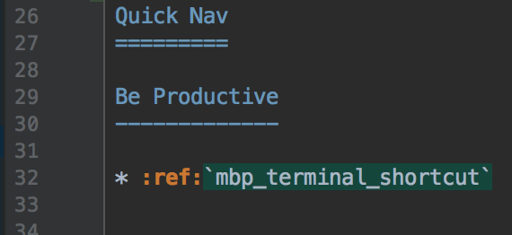

Sphinx How To
=============

How to write math
-----------------

http://www.sphinx-doc.org/en/master/usage/restructuredtext/directives.html?#math

https://zh-sphinx-doc.readthedocs.io/en/latest/ext/math.html

http://www.xavierdupre.fr/blog/2014-04-13_nojs.html

Example of how to force line breaks:
ref: https://salishsea-meopar-docs.readthedocs.io/en/latest/work_env/sphinx_docs.html#forcing-line-breaks

.. |br| raw:: html

     

===========  ===================================================  ==============  ==================
 Date                       Change                                New Value       Changeset
===========  ===================================================  ==============  ==================
27-Oct-2014  1st :file:`nowcast/` run results                     N/A
20-Nov-2014  1st :file:`forecast/` run results                    N/A
26-Nov-2014  Changed to tidal forcing tuned for better |br|       see changeset   fake change
             accuracy at Point Atkinson
===========  ===================================================  ==============  ==================

Customize rtd theme
-------------------
https://github.com/rtfd/sphinx_rtd_theme

Clone above repo, read ``conf.py``, you will know how to customize the theme.
For example, you can hide ``Build with Sphinx`` on footer, hide ``Show page source`` and add favicon.

How to embed images and figures
-------------------------------

.. image:: ../../images/inter_link_1.png
   :width: 200px
   :height: 100px
   :scale: 50 %
   :alt: alternate text
   :align: right

   This is the caption of the figure (a simple paragraph).

How to referencing figures with numbers in Sphinx and reStructuredText
----------------------------------------------------------------------
In the latest versions of Sphinx (1.3+), numbering figures and referencing them from text got a bit easier as support for it is now built-in.

.. code-block:: rst

    .. _your-label:
    .. figure:: ../../images/my_figure.png

    At :numref:`your-label` you can see...

Click `sphinx numref <http://www.sphinx-doc.org/en/stable/markup/inline.html#cross-referencing-figures-by-figure-number>`_ for a reference to official docs for ``:numref:``.

The end result should be something like "At Fig 1.1 you can see...". This technique works both with the default HTML output and the LaTeX output.

In your ``conf.py`` file, make sure to set the flag ``numfig = True`` (click `sphinx config <http://www.sphinx-doc.org/en/stable/config.html#confval-numfig>`_ for reference to offcial docs). There are also configuration options for the references' text format (``numfig_format`` and ``numfig_secnum_depth``).

how to generate an internal link
--------------------------------

**Step 1**  define a symbol to link to. (be sure to define it as ``.. _mbp_internal_link`` instead of ``.. mbp_internal_link``. That underscore ``_`` does matter.)

.. figure:: ../../images/inter_link_1.png
   :scale: 50 %
   :alt: one of the images

   Picture 1. Look at line 4

**Step 2**  use the symbol defined in *step 1* in any place within the docs.

   Picture 2. Look at line 32

how to generate an external link
--------------------------------

There are two ways to do this (Please use ``View page source`` to learn it):

Using named reference
~~~~~~~~~~~~~~~~~~~~~

Test hyperlink: StackOverflow_.

.. _StackOverflow: http://stackoverflow.com/

Using embedded URI (better than above)
~~~~~~~~~~~~~~~~~~~~~~~~~~~~~~~~~~~~~~

Test hyperlink: `Stack Overflow <http://stackoverflow.com/>`_.

Header levels
-------------
level 1: the first party

``===========``

level 1 desc: this document is about xyz

level 2

``-----------``

level 2 desc

level 3

``~~~~~~~~~~~``

level 3 content

level 4

``^^^^^^^^^^^``

level 4 content

level 5

``'''''''''''``

level 5 content

Section headers are created by underlining (and
optionally overlining) the section title with a punctuation character, at least
as long as the text::

   =================
   This is a heading
   =================

Normally, there are no heading levels assigned to certain characters as the
structure is determined from the succession of headings.  However, this
convention is used in `Python's Style Guide for documenting
<https://docs.python.org/devguide/documenting.html#style-guide>`_ which you may
follow:

* ``#`` with overline, for parts
* ``*`` with overline, for chapters
* ``=``, for sections
* ``-``, for subsections
* ``^``, for subsubsections
* ``"``, for paragraphs

..
    comment

.. comment

saDFs

..
   This whole indented block
   is a comment.

   Still in the comment.

